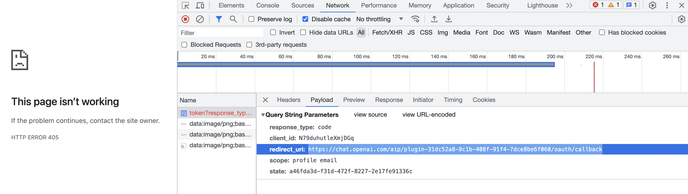

# ChatGPT plugin with Clerk OAuth2 backend

This is an example implementation of ChatGPT plugin running on Cloudflare Workers with Clerk OAuth2 backend.

## Features

- [x] Authenticate users with Clerk during plugin installation
- [x] Authenticated plugin API calls
- [x] OpenAPI schema generation _(using [cloudflare/itty-router-openapi](cloudflare/itty-router-openapi))_

### Plugin routes

- [x] `/user` Get user's details
- [x] `/user/send-email` Send email to signed in user _(using Sendgrid, additional config needed)_

## Setup

### Sign up for Clerk

1. Sign up for [Clerk account](https://dashboard.clerk.com/sign-up)
1. Create [Clerk application](https://dashboard.clerk.com/apps/new)

### Create OAuth application

1. Get **API Key** (Developers -> API Keys -> Secret keys), you will need it later
1. Create [OAuth application](https://clerk.com/docs/reference/backend-api/tag/OAuth-Applications#operation/CreateOAuthApplication), use API key you got from previous steps
   - Use any URL (e.g. `https://example.com`) as callback URL for now, you will change it later.
   - Set `public` to `false`
1. Note the response, you will need following later
   - `client_id`
   - `client_secret`
   - base URL of your OAuth2 Clerk instance (e.g. `https://fond-tuna-4.clerk.accounts.dev`)

### Deploy Workers application

1. Edit [src/index.ts](./src/index.ts) and set following
   - `clerkBaseUrl` to the base URL you got from previous steps
1. `npm install`
1. `npm run deploy`
1. Note the URL of your Workers application, you will need it later

### Configure ChatGPT plugin

1. Install [new ChatGPT plugin](https://chat.openai.com/?model=gpt-4-plugins)
1. Fill in Client ID and Client Secret you got from previous steps
1. Get the verification token and set it as `pluginVerificationToken` in [src/index.ts](./src/index.ts)
1. Redeploy Workers application (`npm run deploy`)
1. Click `Verify tokens`
1. Install the plugin
1. Click `Log in with Plugin with Clerk`
1. You will get 400 error, it's OK - you need to change callback URL in OAuth application
   - Grab the URL from the request URL, you can get decoded one from the network tab
     
   - Edit (PATCH) [OAuth application](https://clerk.com/docs/reference/backend-api/tag/OAuth-Applications#operation/UpdateOAuthApplication) and set the URL as callback URL
   - Close the tab and try to log in again

### Write your own plugin routes

1. Edit [src/index.ts](./src/index.ts) and add your own route handlers
1. Redeploy Workers application (`npm run deploy`)
